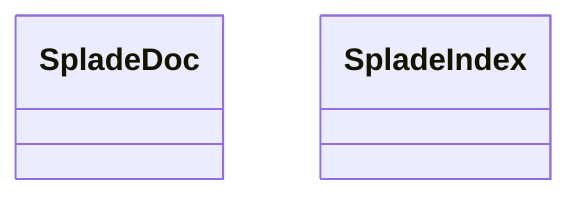

# search_api.splade_index

FastAPI service exposing search endpoints, aggregation helpers, and Problem Details responses.

[View source on GitHub](https://github.com/paul-heyse/kgfoundry/blob/main/src/search_api/splade_index.py)

## Hierarchy

- **Parent:** [search_api](../search_api.md)

## Sections

- **Public API**

## Contents

### search_api.splade_index.SpladeDoc

::: search_api.splade_index.SpladeDoc

### search_api.splade_index.SpladeIndex

::: search_api.splade_index.SpladeIndex

### search_api.splade_index.tok

::: search_api.splade_index.tok

## Relationships

**Imports:** `__future__.annotations`, `collections.abc.Sequence`, `dataclasses.dataclass`, `duckdb`, `kgfoundry_common.navmap_loader.load_nav_metadata`, `pathlib.Path`, `re`, `typing.Final`, `typing.TYPE_CHECKING`

**Imported by:** [search_api](../search_api.md)

## Autorefs Examples

- [search_api.splade_index.SpladeDoc][]
- [search_api.splade_index.SpladeIndex][]
- [search_api.splade_index.tok][]

## Inheritance



## Neighborhood

```d2
direction: right
"search_api.splade_index": "search_api.splade_index" { link: "https://github.com/paul-heyse/kgfoundry/blob/main/src/search_api/splade_index.py" }
"__future__.annotations": "__future__.annotations"
"search_api.splade_index" -> "__future__.annotations"
"collections.abc.Sequence": "collections.abc.Sequence"
"search_api.splade_index" -> "collections.abc.Sequence"
"dataclasses.dataclass": "dataclasses.dataclass"
"search_api.splade_index" -> "dataclasses.dataclass"
"duckdb": "duckdb"
"search_api.splade_index" -> "duckdb"
"kgfoundry_common.navmap_loader.load_nav_metadata": "kgfoundry_common.navmap_loader.load_nav_metadata"
"search_api.splade_index" -> "kgfoundry_common.navmap_loader.load_nav_metadata"
"pathlib.Path": "pathlib.Path"
"search_api.splade_index" -> "pathlib.Path"
"re": "re"
"search_api.splade_index" -> "re"
"typing.Final": "typing.Final"
"search_api.splade_index" -> "typing.Final"
"typing.TYPE_CHECKING": "typing.TYPE_CHECKING"
"search_api.splade_index" -> "typing.TYPE_CHECKING"
"search_api": "search_api" { link: "https://github.com/paul-heyse/kgfoundry/blob/main/src/search_api/__init__.py" }
"search_api" -> "search_api.splade_index"
"search_api" -> "search_api.splade_index" { style: dashed }
```

