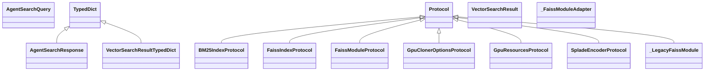

# search_api.types

FastAPI service exposing search endpoints, aggregation helpers, and Problem Details responses.

[View source on GitHub](https://github.com/kgfoundry/kgfoundry/blob/main/src/search_api/types.py)

## Sections

- **Public API**

## Contents

### search_api.types.AgentSearchQuery

::: search_api.types.AgentSearchQuery

### search_api.types.AgentSearchResponse

::: search_api.types.AgentSearchResponse

*Bases:* TypedDict

### search_api.types.BM25IndexProtocol

::: search_api.types.BM25IndexProtocol

*Bases:* Protocol

### search_api.types.FaissIndexProtocol

::: search_api.types.FaissIndexProtocol

*Bases:* Protocol

### search_api.types.FaissModuleProtocol

::: search_api.types.FaissModuleProtocol

*Bases:* Protocol

### search_api.types.GpuClonerOptionsProtocol

::: search_api.types.GpuClonerOptionsProtocol

*Bases:* Protocol

### search_api.types.GpuResourcesProtocol

::: search_api.types.GpuResourcesProtocol

*Bases:* Protocol

### search_api.types.SpladeEncoderProtocol

::: search_api.types.SpladeEncoderProtocol

*Bases:* Protocol

### search_api.types.VectorSearchResult

::: search_api.types.VectorSearchResult

### search_api.types.VectorSearchResultTypedDict

::: search_api.types.VectorSearchResultTypedDict

*Bases:* TypedDict

### search_api.types._FaissModuleAdapter

::: search_api.types._FaissModuleAdapter

### search_api.types._LegacyFaissModule

::: search_api.types._LegacyFaissModule

*Bases:* Protocol

### search_api.types._labels_or_default

::: search_api.types._labels_or_default

### search_api.types._legacy_index_flat_ip

::: search_api.types._legacy_index_flat_ip

### search_api.types._legacy_index_id_map2

::: search_api.types._legacy_index_id_map2

### search_api.types._legacy_normalize_l2

::: search_api.types._legacy_normalize_l2

### search_api.types.wrap_faiss_module

::: search_api.types.wrap_faiss_module

## Relationships

**Imports:** `__future__.annotations`, `collections.abc.Callable`, `collections.abc.Mapping`, `collections.abc.Sequence`, `contextlib.suppress`, `dataclasses.dataclass`, `kgfoundry_common.navmap_loader.load_nav_metadata`, `kgfoundry_common.problem_details.JsonValue`, `numpy`, `numpy.typing`, `numpy.typing.NDArray`, `operator.attrgetter`, `typing.Protocol`, `typing.TYPE_CHECKING`, `typing.TypedDict`, `typing.cast`

**Imported by:** [search_api](./search_api.md)

## Autorefs Examples

- [search_api.types.AgentSearchQuery][]
- [search_api.types.AgentSearchResponse][]
- [search_api.types.BM25IndexProtocol][]
- [search_api.types._labels_or_default][]
- [search_api.types._legacy_index_flat_ip][]
- [search_api.types._legacy_index_id_map2][]

## Inheritance



## Neighborhood

```d2
direction: right
"search_api.types": "search_api.types" { link: "./search_api/types.md" }
"__future__.annotations": "__future__.annotations"
"search_api.types" -> "__future__.annotations"
"collections.abc.Callable": "collections.abc.Callable"
"search_api.types" -> "collections.abc.Callable"
"collections.abc.Mapping": "collections.abc.Mapping"
"search_api.types" -> "collections.abc.Mapping"
"collections.abc.Sequence": "collections.abc.Sequence"
"search_api.types" -> "collections.abc.Sequence"
"contextlib.suppress": "contextlib.suppress"
"search_api.types" -> "contextlib.suppress"
"dataclasses.dataclass": "dataclasses.dataclass"
"search_api.types" -> "dataclasses.dataclass"
"kgfoundry_common.navmap_loader.load_nav_metadata": "kgfoundry_common.navmap_loader.load_nav_metadata"
"search_api.types" -> "kgfoundry_common.navmap_loader.load_nav_metadata"
"kgfoundry_common.problem_details.JsonValue": "kgfoundry_common.problem_details.JsonValue"
"search_api.types" -> "kgfoundry_common.problem_details.JsonValue"
"numpy": "numpy"
"search_api.types" -> "numpy"
"numpy.typing": "numpy.typing"
"search_api.types" -> "numpy.typing"
"numpy.typing.NDArray": "numpy.typing.NDArray"
"search_api.types" -> "numpy.typing.NDArray"
"operator.attrgetter": "operator.attrgetter"
"search_api.types" -> "operator.attrgetter"
"typing.Protocol": "typing.Protocol"
"search_api.types" -> "typing.Protocol"
"typing.TYPE_CHECKING": "typing.TYPE_CHECKING"
"search_api.types" -> "typing.TYPE_CHECKING"
"typing.TypedDict": "typing.TypedDict"
"search_api.types" -> "typing.TypedDict"
"typing.cast": "typing.cast"
"search_api.types" -> "typing.cast"
"search_api": "search_api" { link: "./search_api.md" }
"search_api" -> "search_api.types"
"search_api.types_code": "search_api.types code" { link: "https://github.com/kgfoundry/kgfoundry/blob/main/src/search_api/types.py" }
"search_api.types" -> "search_api.types_code" { style: dashed }
```

