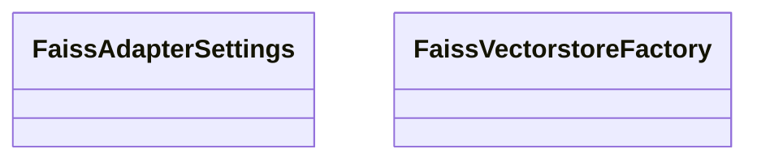

# search_api.vectorstore_factory

FastAPI service exposing search endpoints, aggregation helpers, and Problem Details responses.

[View source on GitHub](https://github.com/kgfoundry/kgfoundry/blob/main/src/search_api/vectorstore_factory.py)

## Sections

- **Public API**

## Contents

### search_api.vectorstore_factory.FaissAdapterSettings

::: search_api.vectorstore_factory.FaissAdapterSettings

### search_api.vectorstore_factory.FaissVectorstoreFactory

::: search_api.vectorstore_factory.FaissVectorstoreFactory

### search_api.vectorstore_factory._ingestion_extra

::: search_api.vectorstore_factory._ingestion_extra

### search_api.vectorstore_factory._observe_metrics

::: search_api.vectorstore_factory._observe_metrics

## Relationships

**Imports:** `__future__.annotations`, `dataclasses.dataclass`, `dataclasses.field`, `kgfoundry_common.errors.IndexBuildError`, `kgfoundry_common.navmap_loader.load_nav_metadata`, `kgfoundry_common.prometheus.CounterLike`, `kgfoundry_common.prometheus.HistogramLike`, `kgfoundry_common.prometheus.build_counter`, `kgfoundry_common.prometheus.build_histogram`, `logging`, `search_api.faiss_adapter.FaissAdapter`, `time`, `typing.Final`, `typing.TYPE_CHECKING`

## Autorefs Examples

- [search_api.vectorstore_factory.FaissAdapterSettings][]
- [search_api.vectorstore_factory.FaissVectorstoreFactory][]
- [search_api.vectorstore_factory._ingestion_extra][]
- [search_api.vectorstore_factory._observe_metrics][]

## Inheritance



## Neighborhood

```d2
direction: right
"search_api.vectorstore_factory": "search_api.vectorstore_factory" { link: "./search_api/vectorstore_factory.md" }
"__future__.annotations": "__future__.annotations"
"search_api.vectorstore_factory" -> "__future__.annotations"
"dataclasses.dataclass": "dataclasses.dataclass"
"search_api.vectorstore_factory" -> "dataclasses.dataclass"
"dataclasses.field": "dataclasses.field"
"search_api.vectorstore_factory" -> "dataclasses.field"
"kgfoundry_common.errors.IndexBuildError": "kgfoundry_common.errors.IndexBuildError"
"search_api.vectorstore_factory" -> "kgfoundry_common.errors.IndexBuildError"
"kgfoundry_common.navmap_loader.load_nav_metadata": "kgfoundry_common.navmap_loader.load_nav_metadata"
"search_api.vectorstore_factory" -> "kgfoundry_common.navmap_loader.load_nav_metadata"
"kgfoundry_common.prometheus.CounterLike": "kgfoundry_common.prometheus.CounterLike"
"search_api.vectorstore_factory" -> "kgfoundry_common.prometheus.CounterLike"
"kgfoundry_common.prometheus.HistogramLike": "kgfoundry_common.prometheus.HistogramLike"
"search_api.vectorstore_factory" -> "kgfoundry_common.prometheus.HistogramLike"
"kgfoundry_common.prometheus.build_counter": "kgfoundry_common.prometheus.build_counter"
"search_api.vectorstore_factory" -> "kgfoundry_common.prometheus.build_counter"
"kgfoundry_common.prometheus.build_histogram": "kgfoundry_common.prometheus.build_histogram"
"search_api.vectorstore_factory" -> "kgfoundry_common.prometheus.build_histogram"
"logging": "logging"
"search_api.vectorstore_factory" -> "logging"
"search_api.faiss_adapter.FaissAdapter": "search_api.faiss_adapter.FaissAdapter"
"search_api.vectorstore_factory" -> "search_api.faiss_adapter.FaissAdapter"
"time": "time"
"search_api.vectorstore_factory" -> "time"
"typing.Final": "typing.Final"
"search_api.vectorstore_factory" -> "typing.Final"
"typing.TYPE_CHECKING": "typing.TYPE_CHECKING"
"search_api.vectorstore_factory" -> "typing.TYPE_CHECKING"
"search_api.vectorstore_factory_code": "search_api.vectorstore_factory code" { link: "https://github.com/kgfoundry/kgfoundry/blob/main/src/search_api/vectorstore_factory.py" }
"search_api.vectorstore_factory" -> "search_api.vectorstore_factory_code" { style: dashed }
```

