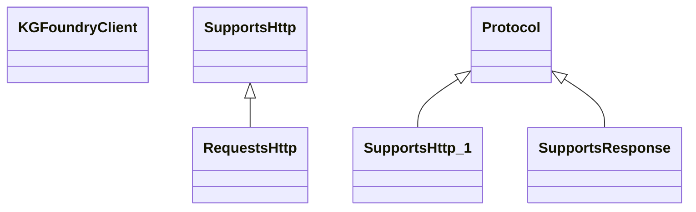

# search_client.client

Lightweight client wrapper around the kgfoundry Search API

[View source on GitHub](https://github.com/kgfoundry/kgfoundry/blob/main/src/search_client/client.py)

## Sections

- **Public API**

## Contents

### search_client.client.KGFoundryClient

::: search_client.client.KGFoundryClient

### search_client.client.RequestsHttp

::: search_client.client.RequestsHttp

*Bases:* SupportsHttp

### search_client.client.SupportsHttp

::: search_client.client.SupportsHttp

*Bases:* Protocol

### search_client.client.SupportsResponse

::: search_client.client.SupportsResponse

*Bases:* Protocol

## Relationships

**Imports:** `__future__.annotations`, `collections.abc.Mapping`, `kgfoundry_common.navmap_loader.load_nav_metadata`, `kgfoundry_common.problem_details.JsonValue`, `requests`, `typing.Final`, `typing.Protocol`, `typing.TYPE_CHECKING`, `typing.cast`

## Autorefs Examples

- [search_client.client.KGFoundryClient][]
- [search_client.client.RequestsHttp][]
- [search_client.client.SupportsHttp][]

## Inheritance



## Neighborhood

```d2
direction: right
"search_client.client": "search_client.client" { link: "./search_client/client.md" }
"__future__.annotations": "__future__.annotations"
"search_client.client" -> "__future__.annotations"
"collections.abc.Mapping": "collections.abc.Mapping"
"search_client.client" -> "collections.abc.Mapping"
"kgfoundry_common.navmap_loader.load_nav_metadata": "kgfoundry_common.navmap_loader.load_nav_metadata"
"search_client.client" -> "kgfoundry_common.navmap_loader.load_nav_metadata"
"kgfoundry_common.problem_details.JsonValue": "kgfoundry_common.problem_details.JsonValue"
"search_client.client" -> "kgfoundry_common.problem_details.JsonValue"
"requests": "requests"
"search_client.client" -> "requests"
"typing.Final": "typing.Final"
"search_client.client" -> "typing.Final"
"typing.Protocol": "typing.Protocol"
"search_client.client" -> "typing.Protocol"
"typing.TYPE_CHECKING": "typing.TYPE_CHECKING"
"search_client.client" -> "typing.TYPE_CHECKING"
"typing.cast": "typing.cast"
"search_client.client" -> "typing.cast"
"search_client.client_code": "search_client.client code" { link: "https://github.com/kgfoundry/kgfoundry/blob/main/src/search_client/client.py" }
"search_client.client" -> "search_client.client_code" { style: dashed }
```

